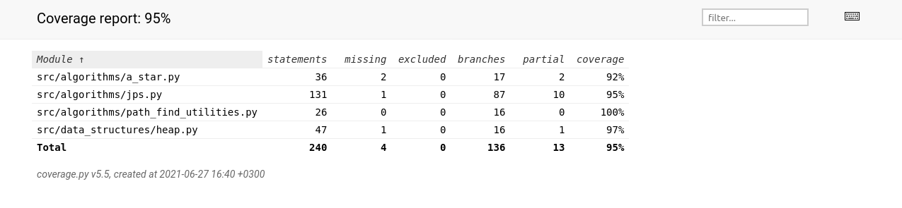
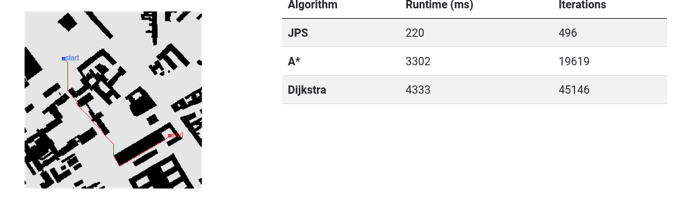
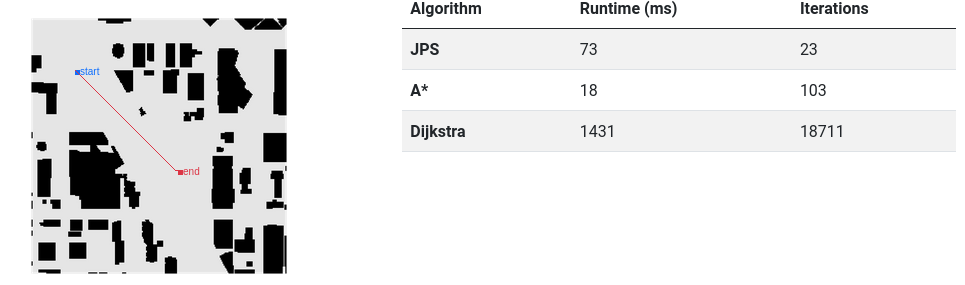
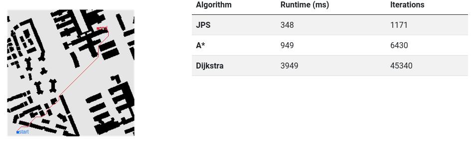

# Testing document

### Unit testing and test coverage
The application contains unit tests that can be performed by utilizing `pytest` module. The unit tests are located in [src/tests/ -folder](https://github.com/roopekole/tira-labra/tree/main/src/tests).

The algorithms and the custom heap data structure are subjected to unit tests.

Branch coverage may be analyzed by performing the test coverage analysis of the `coverage` library.

**Run the test coverage:**


```bash

coverage run --branch -m pytest

```

**Generate test coverage report:**


```bash

coverage report -m

```

Report is generated to *coverage_html_report* directory in project root. 

Configurations are set in file [.coveragerc](.coveragerc).

**Branching coverage report (27.6.2021 17:45 EET)**




### Known issues and bugs
Failing unit tests:
-  [TestJPS: test_jps_simple_mix_map2](https://github.com/roopekole/tira-labra/blob/2a700b980c96c0441c30abb8106266d0b2908acb/src/tests/jps_test.py#L18)


### Performance test

The comparable performance of the algorithms can be analysed by the user by running the application on different parametric selections.

Here are a few examples:

**Example 1**
- Map: Berlin 0
- Start: X = 54, Y = 66
- End: X = 207, Y = 177



**Example 2**
- Map: Denver 1
- Start: X = 44, Y = 52
- End: X = 147, Y = 152



**Example 3**
- Map: Milan 2
- Start: X = 19, Y = 245
- End: X = 180, Y = 36



