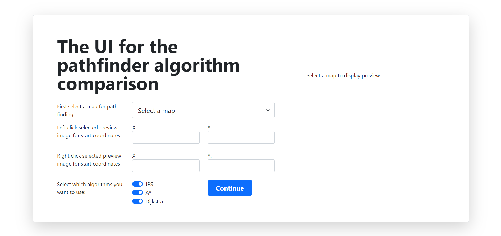

# User manual

This user manual walks through the usage of the pathfinding algorithm comparison app. With this app the user is able to compare _Jump point search_, _A*_, and _Dijkstra_ algorithm for finding the cheapest path on the 256x256 city maps provided Moving AI Labs intiative.

### Select the map, start and end coordinates, and algorithms

As user enters the application, the user is first asked to select the map and then select the start and end coordinates.

Start coordinates are selected by a left mouse click. Blue dot with label *start* appears and the coordinates are filled in the input fields. Similarly, by right mouse click user selects the end coordinates.

User is also asked to select the algorithm for pathfinding. At least one selection must be active.

### Viewing the results

After the user has made the selections and clicks _Continue_ the system finds the shortest path with the selected algorithms. The cheapest path between the selected points is shown for the user on the map. 

The table illustrates the pathfinding runtime in milliseconds and iterations the algorithm made during the runtime.

User may return to start by pressing _Back_ button and run the comparison with different parameter selection.

